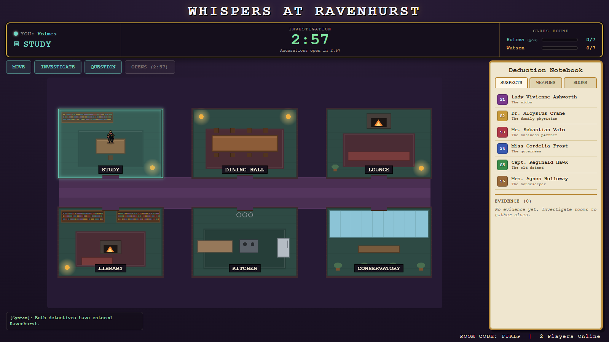

# Whispers at Ravenhurst

> **Last updated:** 2026-06-16

A **two-player, real-time online detective game** — Clue/Cluedo reimagined as a
race. Two players join a private room by code and explore a pixel-art Victorian
mansion **in parallel, in real time** (no turns). Each detective works their own
copy of the manor, gathering evidence and questioning suspects at their own pace.
The only shared outcome is the verdict: lock in an accusation, and a dual-window
timer forces both players to commit before the truth is revealed.



*The unified HUD (identity · clock · clue tracker), the mansion board, the
deduction notebook, and the action log — all visible at a glance.*

---

## Key features

- **Real-time parallel play** — no turns. Both detectives move and act
  simultaneously over WebSockets (Socket.io); each renders only their own sprite.
- **Server-authoritative & cheat-proof** — the solution, every clue's contents,
  and the suspects' dialogue trees live **only** on the server. Each client
  receives a privacy-filtered `view` that never contains the opponent's position,
  the opponent's clues, or the answer key.
- **Free-roam pixel movement** — WASD / arrow-key walking with collision against
  walls and doorways, eight-direction animated sprites, rendered on a raw HTML5
  canvas (no game engine).
- **A solvable, validated mystery** — every case is checked by a real solvability
  validator: each detective must be able to deduce a unique culprit / weapon /
  room from the shared clues plus their own private clues. Red herrings are proven
  to be genuine false leads.
- **Investigation, questioning & confrontation** — search rooms for clues,
  question any of six suspects (with a per-suspect budget), and confront them with
  found evidence to trigger behavioural "tells."
- **Dual-window accusation endgame** — a 3-minute gate, then a lock-in that opens
  the opponent's final window. Scoring rewards correctness, sound reasoning, and
  speed, ending in a simultaneous reveal with an AI-style monologue.
- **Escalating clock pressure** — the timer escalates through five colour/pace
  tiers with synthesized tick sounds and a final-30-seconds screen vignette.

---

## Tech stack

| Layer        | Technology                                                        |
|--------------|-------------------------------------------------------------------|
| **Client**   | React 18 + Vite 5, raw HTML5 Canvas 2D renderer, Web Audio API     |
| **Server**   | Node.js (ESM) + Express 4, Socket.io 4 for real-time sync          |
| **Shared**   | A `/shared` ES-module package imported by *both* client and server |
| **State**    | In-memory, one `GameRoom` per room code (no database yet)          |
| **AI**       | Validated baked case + solvability validator (live API call deferred) |

> **Why raw Canvas over Phaser?** The board is a fixed schematic of six rooms, and
> the only moving things are two sprites. Plain canvas keeps full control of the
> pixel look and avoids a second framework alongside React — the lobby, board, and
> notebook all live in one React component tree. Phaser remains the upgrade path if
> a scrolling tile world is ever needed.

---

## Run it locally

Requires **Node 18+**.

```bash
npm run install:all     # installs client + server dependencies
npm run dev             # starts server (:3001) and client (:5173) together
```

Then open **http://localhost:5173**, click **Create Room** in one tab, and
**Join with Code** in a second tab using the displayed code. The game auto-starts
when both detectives are present.

You can also run the two processes separately:

```bash
npm run server          # backend on :3001
npm run client          # frontend on :5173
```

**Dev Mode** (a checkbox in the lobby) swaps the production clock (10 min game /
3 min accuse gate / 2 min opponent window) for short timers (60 s / 20 s / 30 s)
so the full accusation flow is testable in under two minutes.

### Tests

The server ships with four runnable test suites (no test framework — plain Node
scripts that exit non-zero on failure):

```bash
cd server
npm run test:case       # case-schema + solvability validator (standalone)
npm run test:accuse     # accusation gate / scoring / forfeit logic (standalone)
npm run test:move       # movement + wall-collision geometry (standalone)
npm run test:lobby      # full two-client socket flow — needs a running server:
                        #   WHISPERS_FAST_TIMERS=1 node index.js   (in another shell)
```

---

## Game rules (in brief)

1. **Explore.** Walk the manor with WASD / arrows. You may only enter a room
   connected to your current one (the connection graph gates movement).
2. **Investigate.** Inside a room, **INVESTIGATE** reveals *all* of your clues for
   that room at once. Each room can be searched once per player. You are working
   toward **7 real clues** (3 shared + 4 private); a red herring may also appear
   but never counts toward your total.
3. **Question.** **QUESTION SUSPECT** lets you put up to **3** pooled questions to
   any of the six suspects, and **confront** them with evidence you've found — the
   guilty party leaks subtle behavioural tells.
4. **Accuse.** After the gate opens, **ACCUSE** names a culprit, weapon, and room,
   citing **2–3** of your found clues. Locking in is irreversible and starts your
   rival's final window.
5. **Verdict.** When both have locked in (or the windows close), the truth is
   revealed. Score = correct culprit/weapon/room + sound reasoning + speed.

Mansion layout and connections:

```
Top row:     Study   |  Dining Hall  |  Lounge
Bottom row:  Library  |  Kitchen     |  Conservatory
```

- Study ↔ Library, Study ↔ Dining Hall
- Dining Hall ↔ Lounge, Dining Hall ↔ Kitchen
- Library ↔ Kitchen, Kitchen ↔ Conservatory, Lounge ↔ Conservatory

---

## Project structure

```
whispers-at-ravenhurst/
├── package.json            # root scripts: install + run both apps
├── scripts/dev.js          # spawns client + server together
├── shared/                 # SINGLE SOURCE OF TRUTH (imported by client AND server)
│   ├── mapData.js          # rooms, connection graph, palette, walkable geometry
│   ├── constants.js        # rules: timers, clue counts, question cap, move speed
│   ├── questions.js        # the global pool of suspect questions
│   └── caseSchema.js       # case JSON shape + the solvability validator
├── client/                 # React + Vite frontend
│   ├── public/assets/      # holmes/ + watson/ sprites + sprites.json manifest
│   └── src/
│       ├── App.jsx         # top-level state, socket wiring, accusation timing
│       ├── net/socket.js   # thin Socket.io intent wrapper (the `net` object)
│       ├── game/           # canvas renderer + free-roam character + sound
│       │   ├── BoardCanvas.jsx   # canvas component + requestAnimationFrame loop
│       │   ├── Character.js      # free-roam, collision-aware movement
│       │   ├── drawBoard.js      # pure canvas drawing (rooms, furniture, doors)
│       │   ├── sprites.js        # sprite manifest loader + frame cache
│       │   └── sound.js          # Web-Audio tick / chime / alarm bank
│       └── components/     # Lobby, PlayerHud, ActionBar, TimerBar, ClueTracker,
│                           # ChatLog, DeductionNotebook, SuspectModal,
│                           # AccusationModal, RevealScreen
└── server/                 # Node + Socket.io backend
    ├── index.js            # Express + Socket.io wiring; registers all handlers
    ├── rooms.js            # RoomStore + lobby (create/join) + disconnect
    ├── game.js             # GameRoom: the authoritative state + rules engine
    ├── views.js            # buildView() — THE privacy boundary (only serializer)
    ├── handlers/           # movement, investigate, suspects, accusation
    ├── ai/                 # generateCase.js + the baked fallbackCase.json
    └── test/               # lobbyFlow, caseValidation, accusation, movement
```

See **[ARCHITECTURE.md](ARCHITECTURE.md)** for the technical deep-dive,
**[DEVLOG.md](DEVLOG.md)** for the build journey and design decisions, and
**[ROADMAP.md](ROADMAP.md)** for what's done and what's planned.

---

## Credits

- **Design & engineering:** Naman.
- **Character sprites:** `holmes` and `watson` — eight-direction Walking (6 frames)
  and Breathing-Idle (4 frames) animations, indexed in
  `client/public/assets/sprites.json`.
- Built with React, Vite, Express, and Socket.io.

## License

Not yet licensed. All rights reserved by the author pending a license decision.
